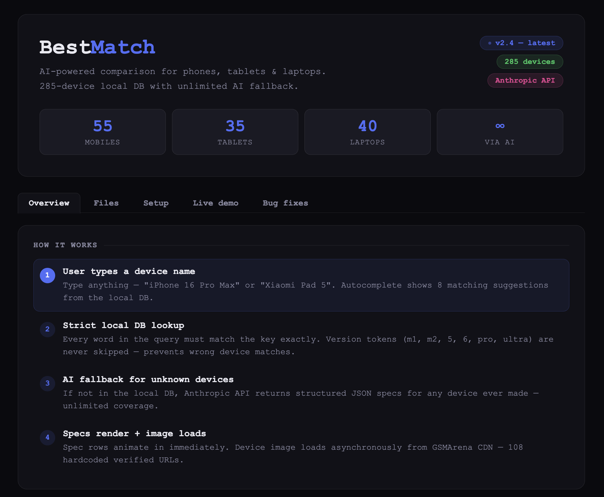

# 🌟 BestMatch – AI-Powered Product Comparison

**BestMatch** now uses the **Anthropic AI API** to fetch live specs for ANY device — no more static databases or manual updates!

---

[](https://imyashchaudhary2.github.io/bestmatch/)

---

## 🚀 What's New (v2.0)

### ✨ AI-Powered Live Search
- Search **any phone, tablet, or laptop** ever made — not just a pre-set list
- Specs are fetched in real-time from the Anthropic API
- Always up to date — covers 2025 devices that didn't exist in v1

### 🎨 Redesigned UI
- Dark, modern interface with glassmorphism header
- Smooth animations on spec reveal
- Fully responsive: works on mobile, tablet, and desktop
- Single shared CSS + JS — no more duplicated code across 3 pages

### 🛠️ Bug Fixes from v1
- Fixed `laptop.js` crash: `LaptopData` (wrong case) → fixed
- Fixed `tablet.js` crash: missing DOM IDs `image${i}` / `specs${i}` → fixed
- Removed duplicate CSS rules across 3 files — now one `shared.css`

---

## 📁 File Structure

```
bestmatch/
├── index.html       ← Mobiles page
├── tablet.html      ← Tablets page
├── laptop.html      ← Laptops page
├── shared.css       ← All styles (was 3 separate CSS files)
├── bestmatch.js     ← All logic + Anthropic API integration
├── favicon.ico
└── site.webmanifest
```

---

## ⚙️ How It Works

1. User types a device name (e.g. "iPhone 16 Pro Max")
2. Autocomplete shows popular suggestions
3. On Enter or suggestion click → Anthropic API is called
4. AI returns structured JSON with all specs
5. Card renders with animated spec rows

---

## 🔧 Setup

The project runs on `claude.ai` which handles the Anthropic API key automatically.

To run locally or deploy elsewhere, add your API key:
```js
// In bestmatch.js, add to fetch headers:
'x-api-key': 'YOUR_API_KEY',
'anthropic-version': '2023-06-01',
'anthropic-dangerous-direct-browser-access': 'true'
```

---

## 📬 Contact
- Email: [imYash.Chaudhary2@gmail.com](mailto:imYash.Chaudhary2@gmail.com)
- Website: [https://bestmch.surge.sh/](https://bestmch.surge.sh/)
